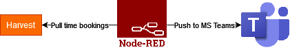

node-red-harvest-timetracking-flows 
===================================

### Intro

This [node-red](https://nodered.org/) project offeres extraction of data from [Harvest](https://harvestapp.com) via their REST API and publishes the results to [MS Teams](https://www.microsoft.com/de-de/microsoft-teams/group-chat-software) via Webhook.

The flow is depicted as follows:




The features this project offers are:
* Extraction of time bookings per person in your team and reminding those who did not book via Webhook
* Extraction of time bookings per person to calculate the utilization rate depending on billable projects and publishing utilization statistics to MS Teams
* Extraction of time bookings per person to calculate the avg amount of hours spent in internal meetings.

The project is divided into several flows on subpages. The different flows come within different tabs in node-red.

### Prerequisites
Running node-RED instance (e.g. as [Docker container](https://nodered.org/docs/getting-started/docker))

For just using the flow.js file, you can import the contents via the Import functionality in node red. If you do that, you should install the nodes 
"node-red-contrib-credentials" via the ui.

If you would like to use the [Projects Feature](https://nodered.org/docs/user-guide/projects/) of node-RED, no installation is needed.

#### Configuration
Every flow comes with a config node, where you need to enter the following:
* ```msg.harvestid``` to specify the harvest project you want to extract.
* ```msg.propertybearer``` to specifcy the Bearer token you have for accessing the Harvest API of your project. The format has to be "Bearer <your_token>". The token can be retrieved from this [site](https://id.getharvest.com/developers).
* ```msg.role_id``` to specify the team you want to fetch the data for.
* ```msg.webhookmsteams``` to configure the webhook you want to write the result data to.
